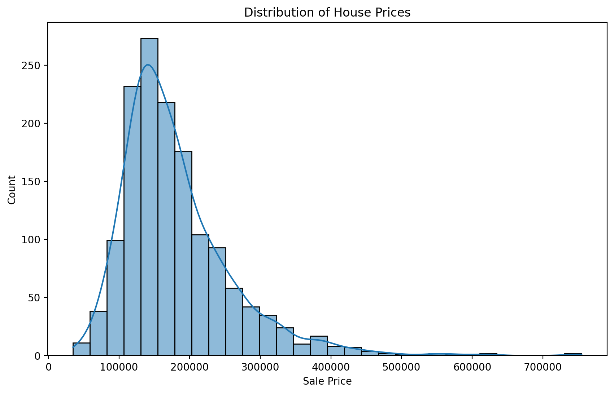
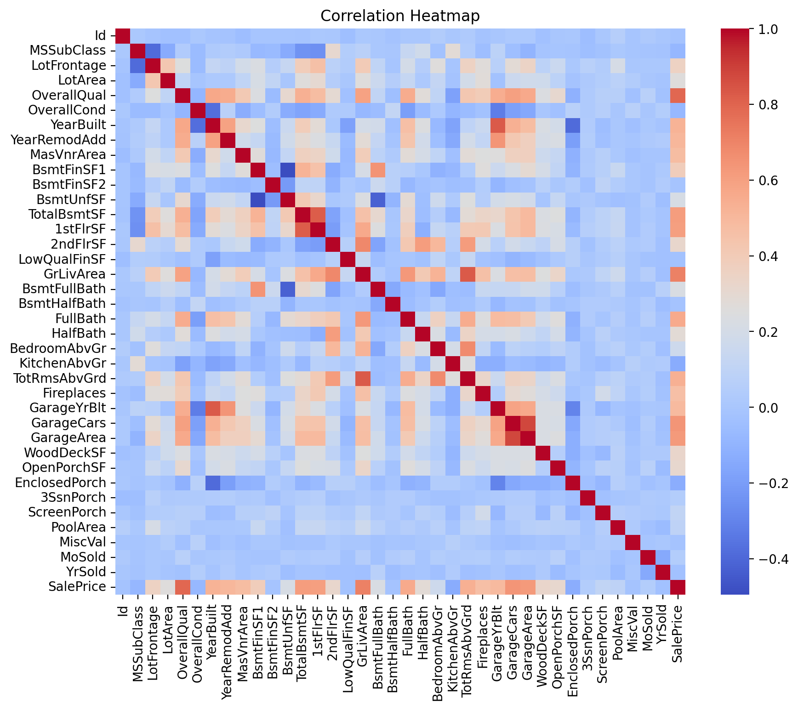
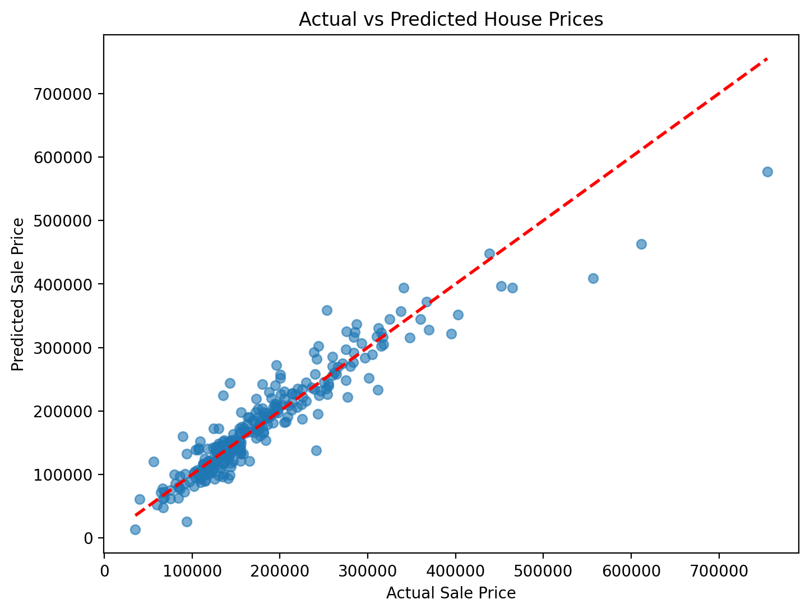
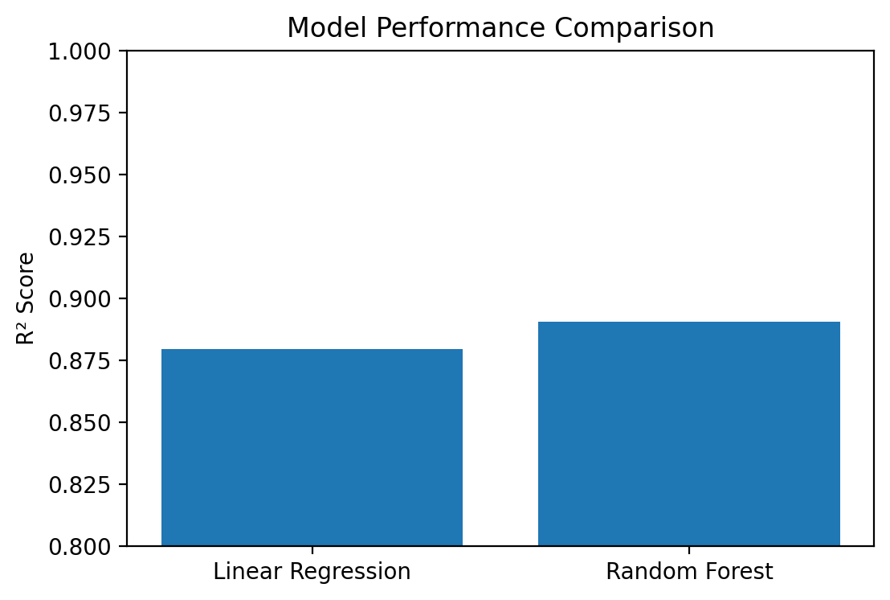

# 🏠 House Price Prediction - Machine Learning Project

## 📌 Project Overview

This project predicts house prices using various machine learning techniques. The dataset contains multiple numerical and categorical features describing residential houses. The goal is to build a regression model that accurately predicts the sale price based on these features.

---

## 🎯 Objective

* Analyze housing data and understand key price-driving factors
* Perform data cleaning and handle missing values
* Apply feature engineering and encoding techniques
* Build and compare regression models
* Evaluate performance using R² score

---

## 📊 Dataset Description

The dataset includes features such as:

* Overall Quality of house
* Living area size
* Garage details
* Basement information
* Neighborhood
* Building type and other structural attributes

**Target Variable:**

* SalePrice

---

## 📈 Exploratory Data Analysis (EDA)

### House Price Distribution

The target variable, **SalePrice**, is right-skewed, indicating that most houses fall within lower to mid-range price categories, while a smaller number of properties have significantly higher prices.

### Correlation Analysis

Correlation analysis was performed to identify the strongest factors influencing house prices. Features such as **OverallQual**, **GrLivArea**, **GarageCars**, **GarageArea**, and **TotalBsmtSF** showed strong positive relationships with SalePrice.

### Key Insights

* Overall Quality strongly correlates with Sale Price
* Larger living area increases house price
* Garage capacity positively impacts price
* Several outliers exist in high-value houses

---

## 🧹 Data Preprocessing

* Handled missing values based on feature meaning:

  * Structural missing values (e.g., no garage, no fireplace) filled with `"None"`
  * Numerical missing values filled using median imputation
* Converted categorical features into numerical form:

  * Ordinal Encoding for ordered features
  * One-Hot Encoding for nominal features
* Applied ColumnTransformer for structured preprocessing pipeline

---

## 🤖 Model Building

Two regression models were trained:

### 1. Linear Regression

* Baseline model
* Captures linear relationships

### 2. Random Forest Regressor

* Ensemble model
* Captures non-linear patterns

---

## 📊 Model Performance

| Model                   | R² Score |
| ----------------------- | -------- |
| Linear Regression       | ~0.87    |
| Random Forest Regressor | ~0.89    |

Random Forest achieved slightly better performance, indicating its ability to capture non-linear relationships present in the dataset.

### Actual vs Predicted Values

The following visualization compares actual house prices with model predictions. Points closer to the diagonal reference line indicate more accurate predictions.

### Model Comparison

Performance comparison of the two regression models using R² Score:

---

## 🧠 Key Learnings

* Importance of proper missing value handling
* Impact of feature engineering on model performance
* Difference between ordinal and nominal encoding
* How pipelines make ML workflows clean and production-ready
* Even simple models can perform well with good data

---

## 🛠️ Tech Stack

* Python
* Pandas
* NumPy
* Matplotlib
* Seaborn
* Scikit-learn

---

## 🚀 Future Improvements

* Hyperparameter tuning using GridSearchCV
* Experimenting with XGBoost and Gradient Boosting models
* Feature selection techniques
* Cross-validation for more robust evaluation
* Log transformation of the target variable

---

## 📌 Conclusion

This project demonstrates a complete machine learning workflow, including exploratory data analysis, missing value handling, feature engineering, preprocessing pipelines, model training, and evaluation.

The results highlight that strong data preprocessing and feature engineering can significantly improve model performance, even when using relatively simple machine learning algorithms.

---

## 👤 Author

**Isha Kalra**
BCA Student | Aspiring AI Engineer

---

## ⭐ If you like this project

Give it a star ⭐ and feel free to fork it!
